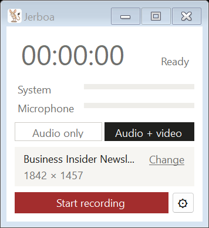

# Jerboa

Annoyingly, none of Microsoft's utilities coming with windows are enabling proper recording of what you hear on your device. You either hear system audio or microphone input, so e.g. in a Video Conference, you are recording either yourself or the other party. 

Jerboa records audio on your Windows device the way you actually need it: Combining both the Microphone input and the system audio into one MP3 file - so you are recording exactly what you heard. Minimalist UI, it does nothing but that. 

So it's perfect to eg record audio from webinars or any video conference system, which you may need if you want to e.g. transcribe the session with a separate service later.

When the slides matter as much as the words, it can record the picture of one window alongside the sound — but that is a switch you reach for, never the default.


The name is a desert rodent: tiny, quick, large ears - you get the idea.

## The idea worth explaining

Every recording is **one stereo MP3 with your microphone on the left channel and the system audio on the right**. That sounds like a technicality; it is the whole point.

- Play the file normally and you hear both, mixed together, like any other recording.
- Split the two channels and you have two clean tracks — one per side of the conversation.

So a single file is both the mixdown and the separated tracks, depending on how you open it. Nothing is lost, nothing has to be produced twice.

This matters most if you send the recording off to be transcribed. Transcription services that read channels separately — AssemblyAI, Deepgram, Speechmatics and Azure all do — get perfect speaker separation for free, because who said what is a physical fact in the file rather than something the software has to guess. Services that mix down to mono (Whisper among them) simply hear the mixture and lose nothing.

Wearing headphones during playback, you will hear yourself hard left and everyone else hard right. That is deliberate. Softening it would smear the two channels into each other and throw away the separation that makes the file useful.

## Installing it

There is no download button here, only source code — which means you build it once
yourself. It is three steps and about five minutes, most of it waiting.

**1. Install the .NET 8 SDK.** Get it from
[dotnet.microsoft.com](https://dotnet.microsoft.com/download/dotnet/8.0) — pick the
**SDK**, not the runtime, for Windows x64. Run the installer and let it finish.

**2. Download this repository.** Use the green **Code** button above, choose
**Download ZIP**, then right-click the downloaded file and pick **Extract All**. Note
where you put the folder.

**3. Build and install it.** Open the extracted folder in File Explorer, click the
address bar, type `powershell` and press Enter. A blue window opens. Paste this line
and press Enter:

```powershell
powershell -ExecutionPolicy Bypass -File setup.ps1
```

That builds Jerboa, puts it in your Start menu and sets it to start when you sign in,
waiting quietly in the notification area. Nothing is written outside your own user
account and no administrator rights are needed.

To remove it again, run `uninstall.ps1` the same way. Your recordings and settings stay where they are; delete `%APPDATA%\Jerboa` by hand if you want those gone too.

## Using it

Click **Start recording**, hold your meeting, click **Stop**. The two level meters tell
you at a glance that sound is actually arriving on both sides — worth a look before an
important call, because a recorder that captured ninety minutes of silence is a bad
thing to discover afterwards.

**Ctrl + Shift + R** starts and stops from anywhere, so you never have to click away from
the meeting window. It is configurable, which you may want: browsers use that combination for a hard reload, and while Jerboa is running it takes precedence.

**Pause** cuts the break out of the recording rather than filling it with silence. The
file contains what was said, not how long you sat there.

**Closing the window does not stop anything.** It tucks Jerboa away into the notification area next to the clock, where the icon shows what is going on: the jerboa when idle, a slowly pulsing red dot while recording, orange pause bars when a recording is paused. Click it to get the window back, right-click it for the same controls without opening anything. Quitting for real is the **Exit** entry in that menu.

## Recording the picture too

Some meetings are only worth keeping because of what was on screen. Switch the mode above
the Start button from **Audio only** to **Audio + video**, choose a window or a screen, and
the recording becomes a single MP4 carrying the picture alongside the same two-channel
sound.

<p align="center">
  
</p>

The mode falls back to **Audio only** before every recording. The window you chose is
remembered, so a run of meetings costs one click rather than a trip through the dialog each
time — but a video recording never happens because a switch was left over from yesterday.
Dismissing the dialog means never mind, not record something.

**1080p at 8 frames a second**, always. That sounds thin until you consider what is
actually on screen: slides need resolution, not frame rate, and quality-based encoding
spends almost nothing on a picture that is not changing. A slide-heavy hour lands between
100 and 180 MB. It is not the setting for smooth motion — it is the one that keeps text
readable and files small.

**The size of the window is the size of the recording.** A window shorter than 1080 rows is
captured as it is and scaled up, which makes slides soft. Jerboa shows you the size of what
you chose and says so before you start, because the only moment that can be fixed is while
you can still drag the window bigger.

Video needs [ffmpeg](https://ffmpeg.org) on your PATH; audio never does. Without it the
switch is disabled and says why.

## Where the recordings go

By default `Music\Recordings` in your user folder, changeable in the settings. Files are
named for when the recording started and how long it lasted:

```
20260909 1430h Recording 47 min.mp3
```

A recording with video is an `.mp4` under the same name. The length is the length of the
file, so pauses are not counted. Around 60 MB per hour for sound alone, 100 to 180 MB with
the picture.

## Getting the two tracks back out

If you want the microphone and the system audio as separate files, one
[ffmpeg](https://ffmpeg.org) command does it:

```bash
ffmpeg -i "20260909 1430h Recording 47 min.mp3" \
  -filter_complex "[0:a]channelsplit=channel_layout=stereo[l][r]" \
  -map "[l]" microphone.mp3 -map "[r]" system.mp3
```

Every file also carries a note in its metadata saying which channel is which, so this is
still answerable in a year's time.

## Settings

|                        |                                                                                                                     |
| ---------------------- | ------------------------------------------------------------------------------------------------------------------- |
| **Folder**             | Where recordings are written                                                                                        |
| **System audio**       | Which playback device to listen in on — normally leave it on the default                                            |
| **Microphone**         | Which microphone to record                                                                                          |
| **End recording**      | Stops by itself after a chosen length, from 15 minutes to 12 hours. A safety net for the meeting you forget to stop |
| **Shortcut**           | The global start/stop key. Click the field and press the combination you want                                       |
| **Keep window on top** | Keeps the window above the meeting window                                                                           |
| **Start with Windows** | Starts at sign-in, minimised to the notification area                                                               |

## Known limitations

**Bluetooth headsets in hands-free mode.** When Windows switches a headset to its
hands-free profile, playback quality drops to telephone level — and Jerboa records what the system plays, so the recording drops with it. Nothing can be done about that from here; it is worth knowing before an important call.

**Changing devices mid-recording.** Unplug the headset while recording and the stream
breaks. Jerboa stops, keeps everything captured so far and tells you what happened. It
does not currently pick up the new device by itself.

**Clock drift.** The microphone and the speakers run on separate clocks, so a long
recording could see the two channels slide apart. Jerboa writes both onto one timeline
taken from the system clock and fills in for whichever device falls behind, which holds
the two within a few tens of milliseconds of each other over a session. It has not been
proven over the really long haul — if you record a four-hour workshop, listen to the end.

**Tabs are not windows.** Jerboa records a browser window, not a particular tab. Switch
tabs mid-recording and the recording follows the window. Capturing one tab regardless of
what is on screen would need a browser extension, which is a different program altogether.

**A minimised window produces no picture at all** — not a frozen frame, nothing. Jerboa
notices within a few seconds and tells you, and the sound carries on regardless, but there
is no picture to be had while the window stays minimised.

**Resizing the window mid-recording** does not change the recording. The frame size is
settled when you press Start, and a window made bigger afterwards is fitted back into it.

**One recording at a time**, and one Jerboa at a time. Starting it twice just brings the
running window forward.

## Recording other people

Recording a conversation without telling the people in it is illegal in a lot of places,
Germany among them. A public webinar with a speaker presenting is usually a different matter from a meeting among colleagues. Ask first; it takes a sentence.

## Building it yourself

```powershell
dotnet publish -c Release -r win-x64 --self-contained true `
  -p:PublishSingleFile=true -p:IncludeNativeLibrariesForSelfExtract=true `
  -p:EnableCompressionInSingleFile=true -o dist
```

There is a self-test that records a few seconds without any interface and reports what
it captured, including how much alignment correction was needed:

```powershell
.\dist\Jerboa.exe --selftest 30
```

`--screenshot <prefix>` renders each window state to PNG files without opening anything, which is how the pictures above were made.

`--videotest 20 "<part of a window title>"` captures a window with no interface at all and
reports the frame rate, how much was read back out of video memory and what it cost. Leave
the title off to capture the main screen.

**On an ARM machine** — a Snapdragon laptop, say — this builds and runs fine, but it
stays an x64 program running under Windows' emulation. That is not laziness: the MP3
encoder is a native library that ships for x86 and x64 only, with no ARM64 build
available. A native ARM64 version would mean compiling LAME for ARM64 first, or dropping it for the encoder built into Windows — which cannot be told to keep the two stereo channels strictly apart, and that would cost the one feature this program exists for.

**How it works inside**, in three sentences. System audio is captured through WASAPI
loopback, which taps the playback device before the sound reaches the hardware and needs no "stereo mix" and no virtual cable; a silent playback stream runs alongside it, because an idle device delivers no loopback data at all and the recording would grow holes. Both inputs are reduced to one channel each, buffered, and emitted onto a single timeline driven by the system clock, padding whichever has fallen behind — that is what keeps the channels aligned. The two are interleaved into stereo and encoded to MP3 as they arrive, so a crash leaves a playable file rather than a broken one. Video, when asked for, is captured through Windows.Graphics.Capture and written as a second, silent file on its own pump; the two are laid together once at the end, shifted by the difference between their first written moments. Building it needs the Windows 10 22621 SDK, but the result still runs on Windows 10 1903.

## Licence

[MIT](LICENSE).

Jerboa uses [NAudio](https://github.com/naudio/NAudio) (MIT) and, through
[NAudio.Lame](https://github.com/Corey-M/NAudio.Lame) (MIT), the
[LAME](https://lame.sourceforge.io) MP3 encoder, which is LGPL 2.1. LAME is not includedin this repository — it is fetched when you build. If you distribute a compiled Jerboa to other people, the LGPL applies to that copy and you should read it first.
